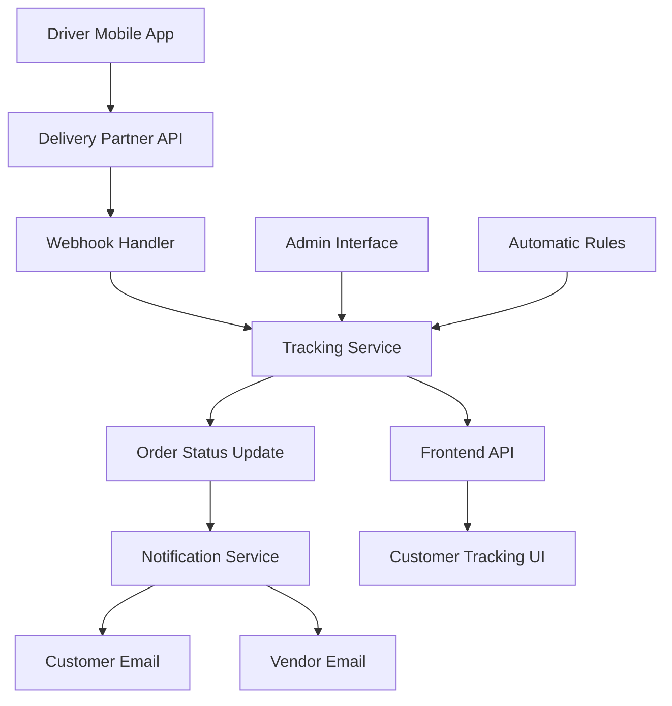
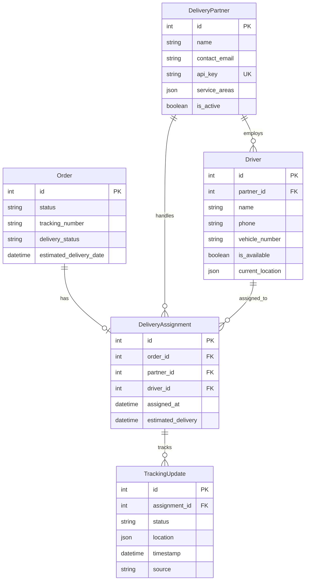

# Design Document: Delivery Tracking System

## Overview

The delivery tracking system extends the existing SokoHub Django e-commerce platform to provide real-time delivery tracking functionality. The system replaces static mock data with dynamic tracking information through a comprehensive backend architecture that includes delivery partner management, driver assignment, real-time location updates, and API integration for external delivery services.

The design leverages Django's ORM for data persistence, Django REST Framework for API endpoints, Django signals for event-driven updates, and integrates seamlessly with the existing elaborate frontend tracking interface that includes Google Maps, delivery timelines, and driver information displays.

## Architecture

### System Components

The delivery tracking system follows a layered architecture pattern:

**Data Layer:**
- Extended Django models for delivery partners, drivers, and tracking updates
- Relationship management between orders, drivers, and delivery partners
- Audit trail storage for all tracking events

**Service Layer:**
- Tracking service for status updates and location management
- Notification service for customer and vendor communications
- Analytics service for performance metrics and reporting

**API Layer:**
- REST endpoints for external delivery partner integration
- Internal API for frontend data consumption
- Webhook handlers for real-time updates

**Integration Layer:**
- Django admin interface extensions for delivery management
- Signal handlers for automatic status progression
- Email notification system integration

### Data Flow Architecture



## Components and Interfaces

### Core Models

**DeliveryPartner Model:**
```python
class DeliveryPartner(models.Model):
    name = models.CharField(max_length=200)
    contact_email = models.EmailField()
    contact_phone = models.CharField(max_length=20)
    api_key = models.CharField(max_length=255, unique=True)
    service_areas = models.JSONField(default=list)  # Geographic coverage
    capabilities = models.JSONField(default=dict)   # Service types, max weight, etc.
    is_active = models.BooleanField(default=True)
    created_at = models.DateTimeField(auto_now_add=True)
```

**Driver Model:**
```python
class Driver(models.Model):
    partner = models.ForeignKey(DeliveryPartner, on_delete=models.CASCADE)
    name = models.CharField(max_length=200)
    phone = models.CharField(max_length=20)
    vehicle_type = models.CharField(max_length=100)
    vehicle_number = models.CharField(max_length=50)
    is_available = models.BooleanField(default=True)
    current_location = models.JSONField(null=True, blank=True)
    created_at = models.DateTimeField(auto_now_add=True)
```

**DeliveryAssignment Model:**
```python
class DeliveryAssignment(models.Model):
    order = models.OneToOneField(Order, on_delete=models.CASCADE)
    partner = models.ForeignKey(DeliveryPartner, on_delete=models.CASCADE)
    driver = models.ForeignKey(Driver, on_delete=models.SET_NULL, null=True)
    assigned_at = models.DateTimeField(auto_now_add=True)
    estimated_delivery = models.DateTimeField(null=True, blank=True)
    actual_delivery = models.DateTimeField(null=True, blank=True)
```

**TrackingUpdate Model:**
```python
class TrackingUpdate(models.Model):
    STATUS_CHOICES = [
        ('processing', 'Processing'),
        ('picked_up', 'Picked Up'),
        ('in_transit', 'In Transit'),
        ('out_for_delivery', 'Out for Delivery'),
        ('delivered', 'Delivered'),
        ('failed_delivery', 'Failed Delivery'),
    ]
    
    assignment = models.ForeignKey(DeliveryAssignment, on_delete=models.CASCADE)
    status = models.CharField(max_length=20, choices=STATUS_CHOICES)
    location = models.JSONField(null=True, blank=True)  # {lat, lng, address}
    notes = models.TextField(blank=True)
    timestamp = models.DateTimeField()
    source = models.CharField(max_length=50)  # 'api', 'admin', 'auto'
    created_at = models.DateTimeField(auto_now_add=True)
```

### Service Interfaces

**TrackingService:**
```python
class TrackingService:
    def update_order_status(self, order_id: int, status: str, location: dict = None, notes: str = "") -> bool
    def get_tracking_data(self, order_id: int) -> dict
    def assign_driver(self, order_id: int, driver_id: int) -> bool
    def calculate_eta(self, assignment_id: int) -> datetime
    def validate_status_transition(self, current_status: str, new_status: str) -> bool
```

**NotificationService:**
```python
class NotificationService:
    def send_status_update(self, order_id: int, status: str) -> bool
    def send_driver_assignment(self, order_id: int, driver_id: int) -> bool
    def send_delivery_confirmation(self, order_id: int) -> bool
    def notify_vendors(self, order_id: int, status: str) -> bool
```

### API Endpoints

**External Partner API:**
```
POST /api/v1/tracking/update/
- Authentication: API Key
- Payload: {order_id, status, location, timestamp, notes}
- Response: {success, message, tracking_number}

GET /api/v1/orders/{partner_id}/
- Authentication: API Key  
- Response: List of assigned orders for partner

POST /api/v1/driver/location/
- Authentication: API Key
- Payload: {driver_id, location, timestamp}
- Response: {success, message}
```

**Internal Frontend API:**
```
GET /api/internal/tracking/{order_id}/
- Authentication: Session/Token
- Response: Complete tracking data for frontend

GET /api/internal/orders/{user_id}/tracking/
- Authentication: Session/Token
- Response: Tracking data for all user orders
```

## Data Models

### Extended Order Model

The existing Order model will be extended with delivery-specific fields:

```python
# Additional fields for Order model
class Order(models.Model):
    # ... existing fields ...
    
    # New delivery tracking fields
    tracking_number = models.CharField(max_length=100, blank=True, null=True)
    delivery_status = models.CharField(
        max_length=20, 
        choices=TrackingUpdate.STATUS_CHOICES,
        default='processing'
    )
    estimated_delivery_date = models.DateTimeField(null=True, blank=True)
    delivery_instructions = models.TextField(blank=True)
    
    @property
    def current_tracking_data(self):
        """Get latest tracking information for frontend"""
        if hasattr(self, 'deliveryassignment'):
            assignment = self.deliveryassignment
            latest_update = assignment.trackingupdate_set.order_by('-timestamp').first()
            return {
                'status': latest_update.status if latest_update else 'processing',
                'location': latest_update.location if latest_update else None,
                'driver': {
                    'name': assignment.driver.name if assignment.driver else None,
                    'phone': assignment.driver.phone if assignment.driver else None,
                    'vehicle': assignment.driver.vehicle_number if assignment.driver else None,
                } if assignment.driver else None,
                'partner': {
                    'name': assignment.partner.name,
                    'phone': assignment.partner.contact_phone,
                } if assignment.partner else None,
                'estimated_delivery': assignment.estimated_delivery,
                'tracking_history': [
                    {
                        'status': update.status,
                        'timestamp': update.timestamp,
                        'location': update.location,
                        'notes': update.notes
                    }
                    for update in assignment.trackingupdate_set.order_by('timestamp')
                ]
            }
        return None
```

### Database Relationships



## Error Handling

### API Error Responses

**Standard Error Format:**
```json
{
    "error": {
        "code": "INVALID_STATUS_TRANSITION",
        "message": "Cannot transition from 'delivered' to 'in_transit'",
        "details": {
            "current_status": "delivered",
            "requested_status": "in_transit",
            "valid_transitions": ["completed"]
        }
    },
    "timestamp": "2024-01-15T10:30:00Z",
    "request_id": "req_123456"
}
```

### Error Handling Strategies

**Validation Errors:**
- Invalid status transitions are rejected with detailed error messages
- Location coordinates are validated for reasonable geographic bounds
- API authentication failures return 401 with clear instructions

**System Errors:**
- Database connection failures trigger retry mechanisms with exponential backoff
- External API timeouts fall back to cached data where possible
- Email delivery failures are logged and queued for retry

**Business Logic Errors:**
- Driver assignment conflicts are resolved through automatic reassignment
- Duplicate tracking updates are deduplicated based on timestamp and source
- Invalid order states trigger admin notifications for manual review

### Monitoring and Alerting

**Performance Monitoring:**
- API response times tracked with alerts for >2 second responses
- Database query performance monitored with slow query logging
- Memory usage tracked for background processing tasks

**Business Monitoring:**
- Failed delivery attempts trigger immediate admin notifications
- Delayed deliveries (>24 hours past ETA) generate customer service alerts
- Partner API failures are escalated after 3 consecutive failures

## Testing Strategy

### Unit Testing Approach

**Model Testing:**
- Validate model relationships and constraints
- Test custom model methods and properties
- Verify data integrity and validation rules

**Service Testing:**
- Mock external dependencies (email, partner APIs)
- Test business logic in isolation
- Validate error handling and edge cases

**API Testing:**
- Test authentication and authorization
- Validate request/response formats
- Test rate limiting and throttling

### Property-Based Testing Configuration

The testing strategy employs Django's built-in testing framework with property-based testing using the Hypothesis library. Each property test runs a minimum of 100 iterations to ensure comprehensive coverage through randomization.

**Testing Framework Setup:**
- Primary: Django TestCase with database transactions
- Property Testing: Hypothesis for Django integration
- API Testing: Django REST Framework's APITestCase
- Mock Framework: unittest.mock for external service isolation

**Test Database Configuration:**
- Separate test database with identical schema
- Transaction rollback for test isolation
- Factory classes for test data generation using factory_boy

**Property Test Tagging:**
Each property-based test includes a comment tag referencing the design document property:
```python
# Feature: delivery-tracking-system, Property 1: Status transition validation
```

## Correctness Properties

*A property is a characteristic or behavior that should hold true across all valid executions of a system—essentially, a formal statement about what the system should do. Properties serve as the bridge between human-readable specifications and machine-verifiable correctness guarantees.*

### Property 1: Data Persistence Integrity
*For any* delivery partner, driver, or tracking update data, when stored in the system, all required fields should be persisted correctly and retrievable without data loss or corruption.
**Validates: Requirements 1.1, 2.1, 9.1**

### Property 2: Input Validation Consistency  
*For any* input data (partner information, driver details, tracking updates, location coordinates), the system should consistently validate required fields, data formats, and business rules, rejecting invalid data with appropriate error messages.
**Validates: Requirements 1.2, 3.3, 4.4, 5.3**

### Property 3: Status Transition Validity
*For any* order status change, the system should only allow valid transitions according to the defined workflow (pending → processing → shipped → out_for_delivery → delivered), rejecting invalid transitions and logging errors appropriately.
**Validates: Requirements 3.2, 3.5, 11.5**

### Property 4: Notification Triggering Completeness
*For any* significant order event (status change, driver assignment, delivery completion), the system should trigger appropriate notifications to all relevant parties (customers, vendors) with complete information including tracking details and contact information.
**Validates: Requirements 7.1, 7.2, 8.1, 8.2**

### Property 5: Location Tracking Accuracy
*For any* driver location update, the system should store valid GPS coordinates with timestamps, calculate reasonable ETAs, and provide the most recent location data when requested for tracking displays.
**Validates: Requirements 4.1, 4.2, 4.3, 4.5**

### Property 6: API Authentication and Response Consistency
*For any* API request from delivery partners, the system should authenticate the partner, validate permissions, process valid requests successfully, and return appropriate HTTP status codes and error messages for all scenarios.
**Validates: Requirements 5.1, 5.2, 5.4, 5.5**

### Property 7: Admin Interface Data Completeness
*For any* delivery-related entity viewed in the admin interface, all required information (status, driver details, tracking history, partner information) should be displayed correctly with proper filtering and search functionality.
**Validates: Requirements 6.1, 6.2, 6.4, 6.5**

### Property 8: Driver Assignment and Management
*For any* driver assignment to an order, the system should update order information, notify customers, handle driver status changes appropriately, and support reassignment when necessary.
**Validates: Requirements 2.2, 2.3, 2.4, 2.5**

### Property 9: Automatic Status Progression Rules
*For any* configured automatic status transition rule (driver assignment, location-based updates), the system should execute the transition correctly, log the trigger source, and maintain manual override capability while validating against business rules.
**Validates: Requirements 11.1, 11.2, 11.3, 11.4**

### Property 10: Frontend Integration Compatibility
*For any* frontend request for tracking data, the system should return data in the expected format with current status, location coordinates suitable for Google Maps, driver information, and timeline data that maintains compatibility with existing UI components.
**Validates: Requirements 10.1, 10.2, 10.3, 10.4, 10.5**

### Property 11: Audit Trail and History Preservation
*For any* tracking update or system change, the system should preserve complete historical records with timestamps and source information, support querying by various criteria, and maintain data for compliance and analysis purposes.
**Validates: Requirements 9.2, 9.3, 9.4, 9.5**

### Property 12: Performance Analytics and Reporting
*For any* delivery performance calculation, the system should accurately compute metrics (delivery times, on-time performance, satisfaction rates), aggregate data correctly by various dimensions, generate appropriate alerts for issues, and provide dashboard views with accurate KPIs.
**Validates: Requirements 12.1, 12.2, 12.3, 12.4, 12.5**

### Property 13: Critical Notification Override
*For any* critical delivery event (failed delivery, significant delays), the system should send immediate notifications regardless of customer preferences while respecting opt-out settings for non-critical updates.
**Validates: Requirements 7.4, 7.5**

### Property 14: Vendor Integration and Feedback
*For any* completed delivery involving vendor products, the system should send confirmation to vendors with customer feedback options, aggregate performance data for reporting, and alert vendors about delivery issues for follow-up.
**Validates: Requirements 8.3, 8.4, 8.5**

### Property 15: Bulk Operations Integrity
*For any* bulk administrative action (status updates, driver assignments), the system should process all items correctly, maintain data integrity, provide appropriate feedback on success/failure rates, and support rollback capabilities where appropriate.
**Validates: Requirements 6.3**